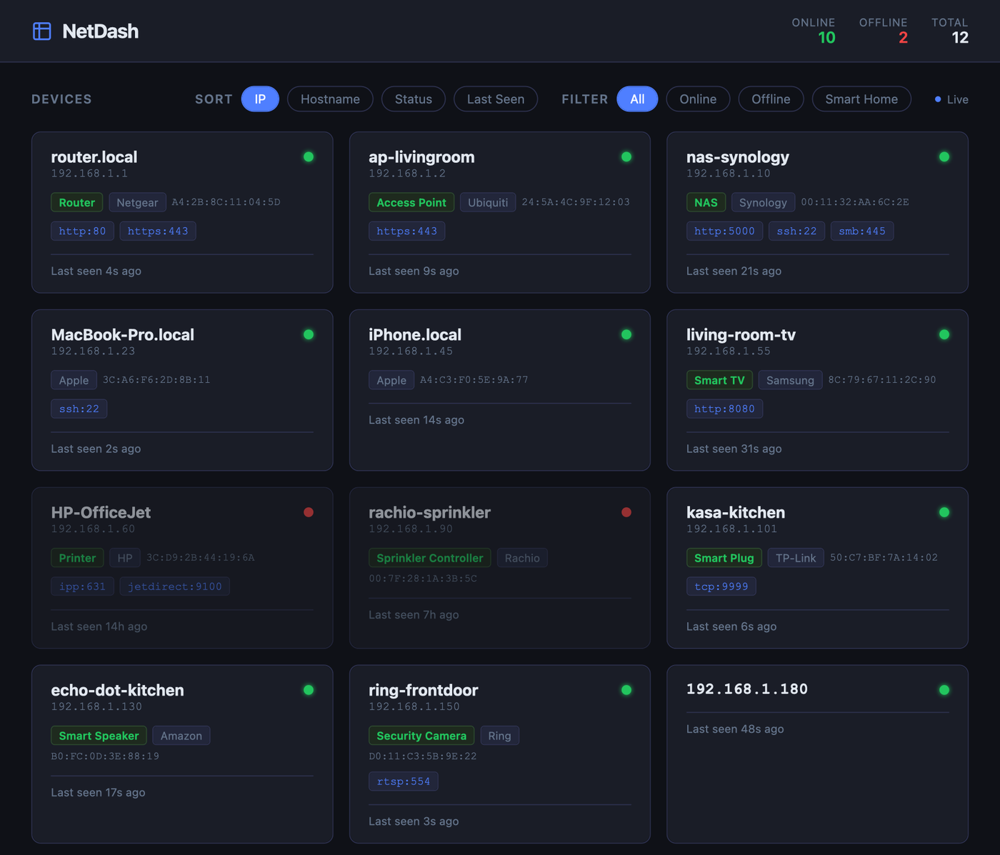
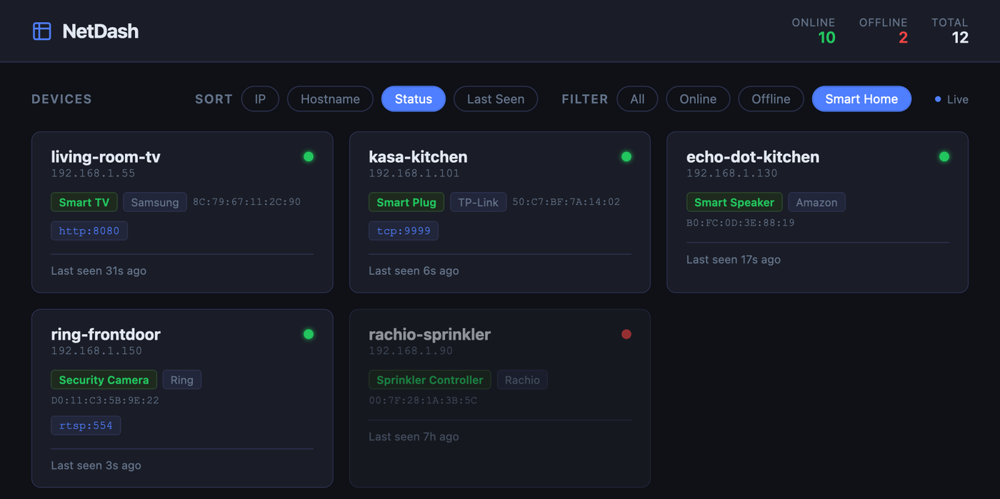

# netdash

A toy network discovery project written mostly by Claude with some design steering. I built it because sometimes my router forgets its DNS entries and I have to figure them out by IP again. This was a simple dashboard that showed everything found on my network, which was kind of helpful when dealing with amnesiac routers.

-- Claude description below --

netdash is a small self-hosted dashboard that watches your local network and shows you what's on it. It runs a handful of discovery methods in the background, keeps a live picture of every device it finds, and serves that picture to a browser over Server-Sent Events so the page updates itself with no polling or reloads.



## What it does

- **Finds devices several ways at once** — TCP connect probing across common ports, an ICMP ping sweep, passive + active ARP table reads, mDNS (`_services._dns-sd`) browsing, and SSDP discovery all run as independent background workers and feed the same device store.
- **Enriches what it finds** — reverse DNS for hostnames, an OUI table for vendor lookup from MAC prefixes, and a `devices.json` file for hand-assigned labels (e.g. "Smart Plug", "Security Camera") that survive rescans.
- **Tracks state over time** — online/offline transitions and events are persisted to SQLite (`netdash.db`), so the dashboard reflects history, not just a single scan.
- **Updates live** — the UI subscribes to `/events` (SSE) and re-renders as soon as the store changes; no refresh button needed.
- **Sorts and filters** — by IP, hostname, status, or last-seen, and can filter down to just online/offline devices or a "Smart Home" view of labeled IoT devices.

Filtering to just the labeled smart-home devices, sorted by status:



## Running it

### Docker

```bash
docker run -p 8080:8080 \
  -e NETDASH_SUBNET=192.168.1 \
  ghcr.io/mikeder/netdash:main
```

Discovery (ARP reads, ICMP pings) needs raw-socket access, so the container currently runs as root. If you'd rather not do that, grant the binary `CAP_NET_RAW`/`CAP_NET_ADMIN` instead and drop root.

### From source

```bash
go run ./cmd/server
```

Then open [http://localhost:8080](http://localhost:8080).

## Configuration

All configuration is via environment variables, with sane defaults for a typical home `/24`:

| Variable              | Default                                              | Description                                    |
| ---------------------- | ----------------------------------------------------- | ----------------------------------------------- |
| `NETDASH_SUBNET`       | `192.168.1`                                           | The `/24` prefix to scan (no trailing octet)   |
| `NETDASH_INTERFACE`    | *(auto)*                                              | Network interface to bind ARP scanning to      |
| `NETDASH_SCAN_PORTS`   | `22,53,80,110,139,143,443,445,587,993,995,3306,3389,5432,8080` | Comma-separated TCP ports to probe |
| `NETDASH_DNS`          | `<subnet>.1`                                          | DNS server used for reverse-lookup hostnames   |

### Labeling devices

Drop a `devices.json` next to the binary to pin labels/vendors by IP or MAC — handy for devices that don't announce themselves cleanly:

```json
[
  { "ip": "192.168.1.219", "label": "Smart Plug", "vendor": "Amazon" },
  { "ip": "192.168.1.245", "label": "Security Camera", "vendor": "Ring" }
]
```

These are re-applied on every startup and merge into whatever discovery already found.

## Architecture

```
cmd/server        entrypoint — wires up the store, discovery workers, and HTTP server
internal/
  api/            HTTP handlers (/devices, /events SSE)
  alerts/         event pipeline + SQLite persistence
  config/         env config + devices.json label loading
  device/         the Device model and the in-memory store (single source of truth)
  discovery/      each discovery method (scanner, arp, ping, mdns, ssdp, vendor, hostname)
  storage/        SQLite initialization
static/           the frontend (a single dependency-free HTML file)
```

Every discovery worker runs independently and only ever mutates state through `device.Store`, which fans out change events to SSE subscribers. See [AGENTS.md](AGENTS.md) for more on the design principles and known limitations if you're extending it.
